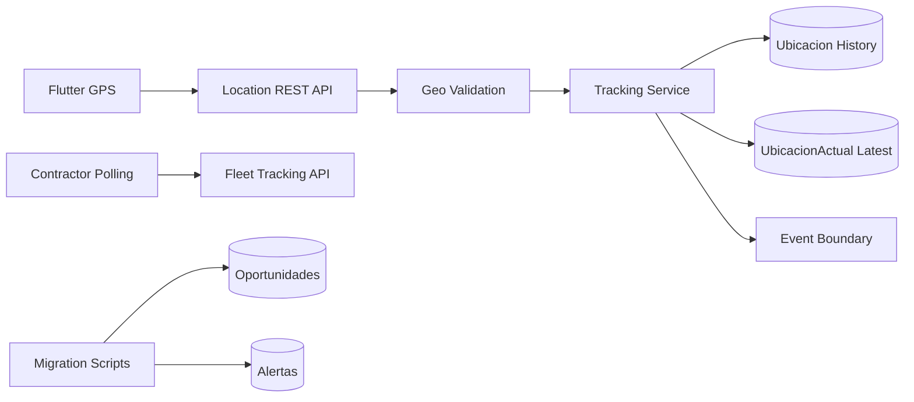

# TrackNariño — Phase 1.5 Report: Migration & Realtime Preparation

**Date:** 2026-05-22  
**Status:** Complete  
**Scope:** Non-destructive coordinate migration prep, geo/tracking integrity, polling stabilization, event/history boundaries for future realtime/offline — without WebSockets, offline queues, geocoding guesses, or destructive cleanup.

---

## 1. Executive Summary

Phase 1.5 hardens TrackNariño’s geo and tracking pipeline while preserving Phase 0 (no fake data, stable auth/API) and Phase 1 (`origin`/`destination`, `Ubicacion` history + `UbicacionActual` latest, contractor fleet polling). Shared validation replaces scattered coordinate checks; migration scripts audit and backfill coordinates explicitly; tracking writes are isolated behind a service with integrity guards; no-op event services prepare pub/sub later; Flutter parsing and contractor polling are safer and less noisy.

---

## 2. Sources & Constraints

| Source | Role |
|--------|------|
| `.cursor/rules/` | Project engineering rules |
| Phase 0 / Phase 1 agent transcripts | Prior stabilization contracts |
| Context7 | Mongoose + Dart lifecycle reference |

**Explicit non-goals honored:** no UI redesign, no Socket.IO/Redis/RTDB, no offline DB/queue, no paid geocoder, no coordinate inference from city names, no GPS TTL deletion.

---

## 3. Architectural Read (Before → After)

| Risk | Mitigation |
|------|------------|
| Duplicated coordinate validation | `Backend/utils/geoValidation.js` |
| Legacy records unreadable or silently wrong | `geoMigration` metadata on `Oportunidad` / `AlertaSeguridad` |
| Append-only GPS with no policy | `retention` metadata + `trackingPolicy.js` (cleanup disabled) |
| Overlapping contractor polls / map flicker | `PollingController`, initial vs background loading |
| Tracking logic in routes | `trackingService.js` + event stubs after persist |

---

## 4. Backend — Shared Geo Utilities

**File:** `Backend/utils/geoValidation.js`

- Normalizes `lat`/`lng`, `latitud`/`longitud`, GeoJSON `[lng, lat]`
- Range checks, null island rejection, duplicate pair detection
- Origin/destination payload builder for trips
- Conservative route plausibility (distance/duration thresholds)
- `evaluateOpportunityGeo` / `evaluateAlertGeo` for migration status

**Integrated in:** `Oportunidad`, `AlertaSeguridad` (pre-validate), `oportunidadController`, `alertaRoutes`, migration scripts.

---

## 5. Backend — Migration Metadata & Tools

### Models
- `Oportunidad.geoMigration`, `AlertaSeguridad.geoMigration`: `status`, `missingFields`, `source`, `notes`, `reviewedAt`
- Legacy reads do **not** require coordinates

### Scripts (`Backend/scripts/`)
| Script | Purpose |
|--------|---------|
| `auditCoordinates.js` | Audit malformed/missing coords; set `geoMigration`; optional `UbicacionActual` sync from history |
| `exportUnresolvedCoordinates.js` | Export `unresolved` records for manual recovery |
| `applyCoordinateBackfill.js` | Apply reviewed JSON backfill (`--apply` for writes; dry-run default) |
| `lib/connectMongo.js` | Shared Mongo connection |

**Policy:** Never infer coordinates from city names or addresses.

---

## 6. Backend — Tracking Service

**File:** `Backend/services/trackingService.js`  
**Route:** `Backend/routes/ubicacionRoutes.js` delegates writes/reads.

Guards on persist:
- Invalid/out-of-range coordinates rejected
- Mock/test GPS patterns rejected
- Stale client timestamps flagged (server `serverReceivedAt` authoritative for fleet status)
- Duplicate coordinate pairs within window skipped
- Poor accuracy threshold
- Minimum movement threshold vs last point
- `clientEventId` + `sequence` for idempotency/sync-ready metadata
- Monotonic latest update (won’t regress `UbicacionActual` with older timestamps)

**Models:** `Ubicacion` (history + sparse unique `(camionero, clientEventId)`), `UbicacionActual` (latest + indexes). TTL index prepared but **commented out**.

---

## 7. Backend — Event Boundaries (No-Op)

| Service | Events (after DB persist) |
|---------|---------------------------|
| `trackingEventService.js` | `location.updated` (dev log only) |
| `tripEventService.js` | Trip state changes from `oportunidadController` |

Ready for Redis/Socket.IO/Firebase RTDB subscribers without changing write contracts.

---

## 8. Backend — History Retention Preparation

**File:** `Backend/config/trackingPolicy.js`

- Documents `PREPARED_HISTORY_TTL_DAYS`, stale/offline thresholds
- `Ubicacion.retention` subdocument on writes
- `/historial` exposes policy metadata; **no destructive purge**

---

## 9. Backend — Contractor Fleet API

**File:** `Backend/controllers/contratistaController.js` — `GET .../tracking/flota`

Per driver returns: `lastSeenAt`, `serverReceivedAt`, `ageMs`, `trackingStatus`, `isStale`, `isOffline`, `coordinatesValid`, `hasLocation`, `polledAt`, plus camionero/trip context.

**Fix:** `afiliarCamionero` now pushes onto contractor’s `camionerosAfiliados` (canonical direction).

---

## 10. Flutter — Geo Parsing & Models

| File | Change |
|------|--------|
| `lib/utils/geo_utils.dart` | Safe coordinate/date parsing |
| `lib/models/ubicacion_model.dart` | Uses `geo_utils` |
| `lib/models/alerta_model.dart` | Uses `geo_utils` |
| `lib/models/oportunidad_model.dart` | `GeoPointData` via `parseCoordinatesFromDynamic` |
| `lib/models/fleet_tracking_item.dart` | Typed fleet row + stale/offline flags |

---

## 11. Flutter — Tracking Upload (Camionero)

**File:** `lib/services/location_service.dart`

- Fixed `dart:math` usage (removed broken tail `Math` shim)
- 10s / 3m throttle, accuracy filter (500m max)
- Payload: `clientEventId`, `sequence`, `source: gps`, client `timestamp`
- Stream lifecycle: cancel subscription, close `StreamController` on dispose
- Fleet polling **removed** → `ContratistaTrackingService`

**File:** `lib/screens/camionero/camionero_home_screen.dart` — single Provider `LocationService`, deferred init, subscription cancel.

---

## 12. Flutter — Contractor Polling & Map

| File | Change |
|------|--------|
| `lib/services/contratista_tracking_service.dart` | `GET /contratistas/tracking/flota` |
| `lib/services/polling_controller.dart` | In-flight guard, cancel on dispose |
| `lib/screens/contratista/seguimiento_screen.dart` | Typed fleet load; initial spinner only; AppBar background refresh indicator; stale/offline marker colors; removed dead Google Maps stack; `flutter_map` 5 API |

---

## 13. Validation Performed

| Check | Result |
|-------|--------|
| `node --check` on `geoValidation.js`, `trackingService.js`, `ubicacionRoutes.js`, `contratistaController.js` | Pass |
| `flutter analyze` on changed location/seguimiento/fleet files | Pass (2 deprecation infos on `withOpacity`) |

**Not run in CI here:** full `flutter analyze` workspace, integration tests against live MongoDB, migration script execution on production data.

---

## 14. Blockers, Risks & Next Phase

### Blockers
- None for merge; migration **execution** on production DB is an operational step (run audit → export → manual review → `applyCoordinateBackfill --apply`).

### Residual risks
- Records with `geoMigration.status: unresolved` remain non-routable until manually backfilled.
- Polling still pulls full fleet every 10s (acceptable for Phase 1.5; WebSocket phase should delta-update).
- `flutter_map` / dependency versions lag upstream (separate upgrade).

### Recommended Phase 2
1. **Realtime:** Wire `trackingEventService` / `tripEventService` to Socket.IO or Redis pub/sub; contractor UI subscribes instead of poll-only.
2. **Offline:** Local queue + sync worker using existing `clientEventId` / `sequence`.
3. **Migration ops:** Run scripts in staging; attach admin read-only `geoMigration` dashboard.
4. **History:** Enable TTL/archival job behind feature flag after backup policy sign-off.
5. **Geocoding:** Optional paid geocoder behind explicit human-approved backfill only.

---

## File Index (Phase 1.5 Touch Set)

**Backend (new):** `utils/geoValidation.js`, `config/trackingPolicy.js`, `services/trackingService.js`, `services/trackingEventService.js`, `services/tripEventService.js`, `scripts/auditCoordinates.js`, `scripts/exportUnresolvedCoordinates.js`, `scripts/applyCoordinateBackfill.js`, `scripts/lib/connectMongo.js`

**Backend (modified):** `models/Oportunidad.js`, `models/AlertaSeguridad.js`, `models/Ubicacion.js`, `models/UbicacionActual.js`, `routes/ubicacionRoutes.js`, `routes/alertaRoutes.js`, `controllers/contratistaController.js`, `controllers/oportunidadController.js`

**Flutter (new):** `utils/geo_utils.dart`, `models/fleet_tracking_item.dart`, `services/contratista_tracking_service.dart`, `services/polling_controller.dart`

**Flutter (modified):** `services/location_service.dart`, `models/ubicacion_model.dart`, `models/alerta_model.dart`, `models/oportunidad_model.dart`, `screens/contratista/seguimiento_screen.dart`, `screens/camionero/camionero_home_screen.dart`

---

*End of Phase 1.5 report.*
